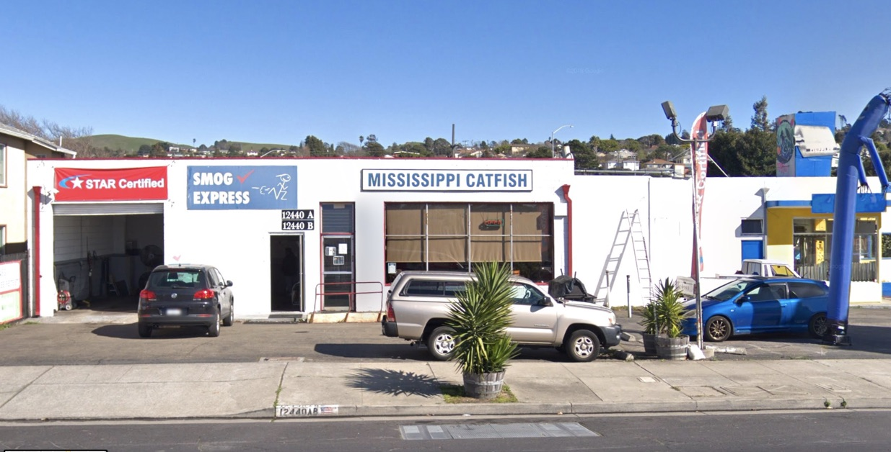
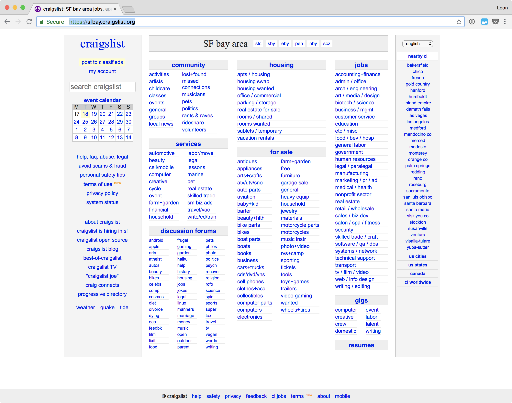
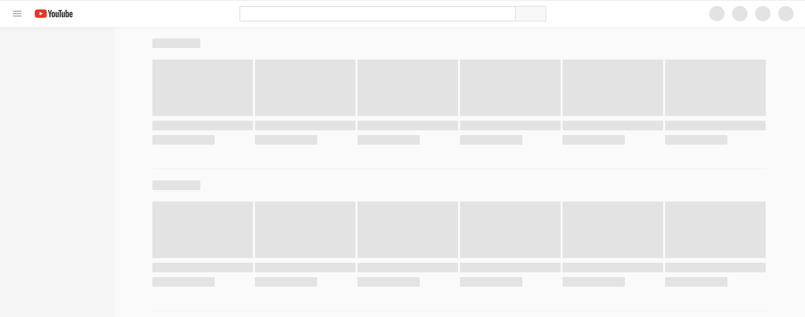
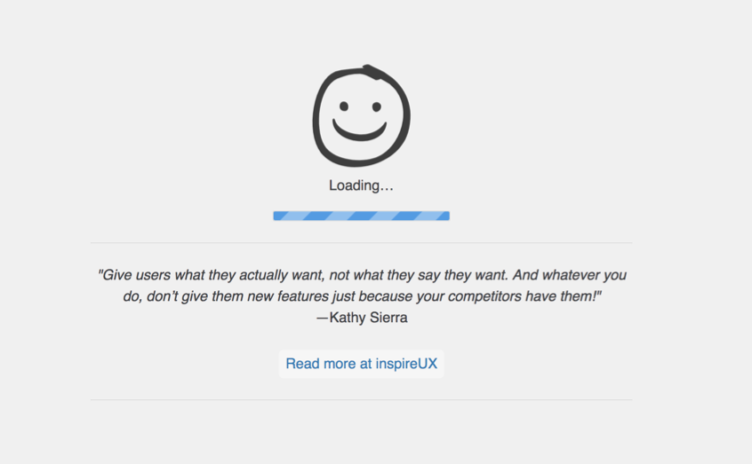

# UI vs. UX - A Culinary Comparison

## The Cooking Analogy

Let's start by stepping out of the digital world.

Consider the thinking that goes into preparing a meal. Good ingredients increase the likelihood of making a tasty dish, however the way that they are prepared and combined is also very important. Additionally, the pairing of dishes in a meal or across courses matters.

A good meal is comprised of ingredients assembled and manipulated intentionally to create an appealing flavor that is greater than the sum of its parts. This is what a good user interface does. 

And yet, the **experience** goes beyond meal!

By focusing on the food, we haven't talked at all about the customer's goal for the meal or their expectations given the money they've paid. A four-star meal may be appropriate for an anniversary dinner, but totally wrong if the diner is primarily interested in getting a quick bite before heading into an important meeting. And your level of satisfaction from a hamburger depends a lot on whether you paid $5 or $50 for it.

The experience and the food are connected, yet separate.

Think about the restaurants in your area. Some of them stick around for decades and others come and go. Is it because the long-lasting ones have the best food and the others have the worst? That is certainly a factor, but the larger experience is a better indicator. How is the service? What's the "ambiance?" Is the location convenient? Do they entice you with coupons or "happy hour" discounts? Do you get feel that you what you pay for?

And now let's move from the culinary plane to the 2d world of screens.

## A Deep Dive into UI Design

**So, what is user interface design?** It's surprisingly hard to define. The crowdsourced (i.e., [wikipedia](https://en.wikipedia.org/wiki/User_interface_design)) definition seems to essentially say "user interface design is the design of software user interfaces," which isn't very enlightening.

A better way to define it is through the process of **deconstructing a user interface into the areas that a UI designer is concerned with**. There are actually multiple layers of UI design and multiple factors that a UI designer considers when creating a user interface.

Let's start with an example. Here is a typical user interface on a web site. 

_**Note:** There are slightly different UI considerations for web, mobile, desktop and other types of software, but, generally speaking, they are all software, and the following concepts apply to all of them._

UI design is concerned with four viewpoints (or layers) of this screen:

1.   Controls
1.   Patterns
1.   Design Principles
1.   Templates

So, let's begin by stepping into the shoes of a UI designer to see how they might approach this website UI.

---

### UI Design Layer 1: Controls

User interface controls are like ingredients in a recipe. Choosing the appropriate ones and using them in the right way lays a foundation for the rest of the interface. 

But before diving into the Controls layer, let's simplify the page above by viewing it as a [wireframe](https://support.balsamiq.com/resources/whatarewireframes/).

Now let's look at some of the UI **Controls** that were used to build this page:

User interface controls (also know as elements, components, and "widgets") are individual pieces of a user interface that perform a single function. Some examples are links, buttons, and icons. Even plain text can be considered a control, since its function is to describe or label something within the user interface.

Each one of these controls was selected for a specific reason. **UI design is concerned with the process and rationale of choosing controls.** 

---

### UI Design Layer 2: Patterns

Returning to our analogy, even with the right ingredients/controls, things can still go wrong. They can work well together, or not. This is where the process of creating patterns comes in. 

Let's further simplify this page by decreasing the [fidelity](http://konigi.com/uiref/wireframes/) of our wireframe to abstract away the individual controls, like this:

Now let's think about the *groups of controls* and what purpose they serve as units within the page. A UI **Pattern** is a group of controls that function to solve a particular problem. Let's look at some of the patterns on this page:

It can be useful to consider this layer of UI design even before moving on to the level of controls, as each pattern can meet its goals in different ways and using different controls.

---

### UI Design Layer 3: Design Principles

Aesthetics matter. And they're not as subjective as many people think. A meal has sensory characteristics beyond the response from your tongue. What it looks, smells, and even feels like affects its taste.

The most commonly understood definition of UI design is the visual design layer. But even this is more purposeful than most people understand. Visual design isn't merely "making it look pretty." A better way to think of it is as the application of established **visual design principles**, many of which are rooted in scientific psychological, neurological, or physiological understanding.

Common examples of these design principles are [Contrast](https://balsamiq.com/learn/courses/wireframing/principles/contrast/), [Hierarchy](https://balsamiq.com/learn/courses/wireframing/principles/hierarchy/), [Proximity](https://balsamiq.com/learn/courses/wireframing/principles/proximity/), and [Alignment](https://balsamiq.com/learn/courses/wireframing/principles/alignment/).

One way that UI designers evaluate design principles is using the ["squint test"](http://blog.usabilla.com/the-squint-test-how-quick-exposure-to-design-can-reveal-its-flaws/), which helps to further abstract the design into its visual principles. An alternative is to blur the screen.

Either way, the goal is to take your attention away from the content in order to **focus on the visual effects and techniques**.

---

### UI Design Layer 4: Templates

Lastly, making dishes that are consistent and taste good together can be viewed as the difference between a cook and a chef. Templates are a UI designer's secret weapon.

Looking at our example site as a whole, we can view this page as an instance of a **template** that can be reused across the site, rather than a single page that was designed for this particular article of clothing. For a site or product than can have dozens, or even thousands, of screens, it is useful both from the designer/developer and the end-user perspectives to have screens that **behave predictably and look similar across the entire application**.

The example up until now we've been looking at what could be described as a "product detail view" template that would look very similar when any other product is viewed.

Another UI template is a category template, like this one:

Other templates for this site might include one for checking out and purchasing, and another for search results. While every product may use different types of templates, all software types can benefit from a template-based approach to design.

---

## So What the Heck Is UX Then?

So, now let's talk about the areas of UX that *aren't* UI design. 

UI design is a core part of UX in the way that food is a core part of an eating experience. What are the parts of a user's experience with a digital product that aren't impacted by the areas described above?

You have probably seen the [Venn diagrams](https://visual.ly/community/infographic/computers/disciplines-user-experience-design) with a dozen circles showing the overlap between UI and UX. They are accurate. But instead of looking at all of the areas that aren't UX, let's dive into a few of them deeply for a different perspective, again, using our culinary analogy.

Earlier, we talked about a few things that make a restaurant good or bad besides the food. In the same way a user can have a good or bad experience with your product, separate from the quality of the interface.

### UX Is About Expectations

There's a restaurant near my house that I avoided for years. The outside looks like this:

You can probably see why. It is in a building with a smog check station on one side and a car muffler store on the other.

And yet...

I believe that the expectations set by the restaurant's appearance affected people's perception of the food. They expect a quick, inexpensive meal, but maybe don't have high hopes for the food itself. The fact that the food is very good is what is called a [delighter](link) - something that goes beyond expectations (given the context, the same food might only meet expectations elsewhere).

Now look at this website:

The design is very utilitarian. It's not pretty. It sets the expectation that it exists to serve a simple purpose, but, like the catfish restaurant, you could be forgiven for expecting the a poor result from it. 

And yet for decades people have been pleasantly surprised (delighted, even) by the usefulness of Craigslist and its ability to connect them to just what they were looking for. That delight is, in part, due to its functional appearance.

The lesson here is not that ugly design is good, but that people's expectations are shaped by events that occur before they even touch a user interface. Part of UX is to design the pre-use experience with this in mind. 

### UX Is About (Perceived) Performance

Wait, isn't making the application fast the developers job, you say? What does UX have to do with speed?

Let's say that the UI designer is the cook in a restaurant. Clearly, they are the key determinant in how fast the food comes out. 

But think about what the waiter/waitress does? They usually first ask you if you want something to drink. This doesn't take any time for the cook, and it gives the customer something to do while they wait. And then after you order they bring you some bread that been prepared in advance. Within minutes of sitting down you are drinking and eating something, you are already having a restaurant experience, and you haven't even tried any of the real food yet. Lastly, if the food is taking an extra long time, a good waiter or waitress will update you, possibly telling you how much longer you can expect to wait.
 
Even in a casual restaurant, you get an order number, which gives you an idea of how long you'll have to wait.

Waiting 20 minutes for your food with nothing on the table feels a long longer than 20 minutes with a good glass of wine and some snacks. It's not the absolute speed that matters as much as the *perceived* speed.

So what does this have to do with UX?

Have you seen something like this before?

Sites like YouTube and Facebook use skeleton or placeholder screens to show you something almost immediately. These are the bread and butter that the waiter/waitress gives you. By giving you a hint, a preview, of what is coming, you begin the experience earlier and the wait time doesn't feel as long.

These are really just a more customized version of the perennial loading indicator.

UX is concerned with the transitions between experiences.

### UX Is About What Happens Over Time

A user interface is mostly a static object. It may have dynamic elements, but, generally speaking, a software product consists of a series of user interface screens connected together. 

A user's experience, however, is very dynamic and can't be captured in a moment in time. Just like a customer's restaurant experience begins when they walk in the door (or even before, as we saw above) and ends when they leave. It is how they are greeted, what the interior looks like, how much the food costs, the friendliness of the waitstaff, the music, the lighting, and their own individual mood and expectations. 

And each of those factors has an impact as they occur over the duration of the experience.

The same is true for software.

A great tool that UX designers use for visualizing and reflecting this reality is a [**journey map**](https://www.nngroup.com/articles/customer-journey-mapping/)

From the Nielsen Norman Group website:

> In its most basic form, journey mapping starts by compiling a series of user goals and actions into a timeline skeleton. Next, the skeleton is fleshed out with user thoughts and emotions in in order to create a narrative. Finally, that narrative is condensed into a visualization used to communicate insights that will inform design processes.

UX is concerned with the "touch points" along the experience.

### UX Is About Matching the Product to the User's Goals

Finally, a UX designer has to think about whether the product addresses the user's goals. Simply put, does the thing actually do what I want it to do, or is it the right solution to the wrong problem?

If I really want a hamburger and all you serve is chicken, I'm going to leave disappointed, regardless of how tasty the chicken is or how pleasant the ambiance is.

In the end, UX is about user advocacy. A UX designer should know know what users want and don't want and what things are most important to them.
